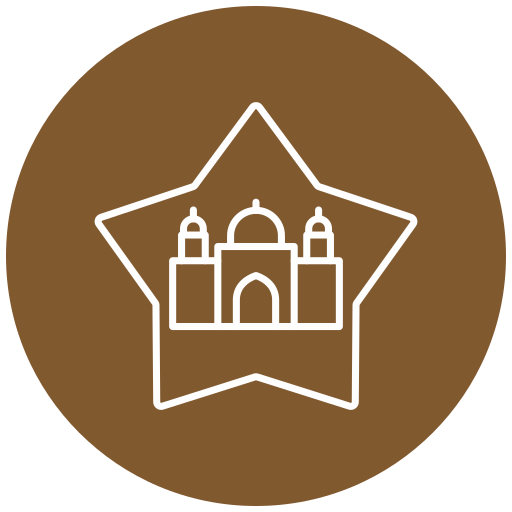

# ArtConnect Maroc 🎨

<h1 align="center">
	
</h1>

<h3 align="center">
	Plateforme interactive de promotion de l'art et la culture marocaine
</h3>

ArtConnect Maroc est une plateforme web interactive développée avec React, destinée à promouvoir l'art et la culture marocaine. Elle permet aux utilisateurs de découvrir, publier et sauvegarder des œuvres et traditions marocaines tout en offrant aux administrateurs une interface de gestion complète.

---

## 📋 Table des matières
- [Aperçu du projet](#aperçu-du-projet)
- [Fonctionnalités](#fonctionnalités)
- [Pages de l'application](#pages-de-lapplication)
- [Technologies utilisées](#technologies-utilisées)
- [Structure du projet](#structure-du-projet)
- [Installation et démarrage](#installation-et-démarrage)
- [User Stories](#user-stories)
- [Travail en équipe](#travail-en-équipe)
- [Contributeurs](#contributeurs)
- [Licence](#licence)

---

## 🎯 Aperçu du projet

**ArtConnect Maroc** vise à créer une plateforme qui connecte les passionnés d'art, les artisans et les amateurs de culture marocaine.

### Objectifs principaux
- Offrir aux utilisateurs une expérience immersive pour explorer le patrimoine marocain
- Permettre aux utilisateurs de sauvegarder leurs œuvres préférées
- Fournir aux administrateurs un tableau de bord complet pour gérer les contenus

---

## ✨ Fonctionnalités

### 👤 Côté Utilisateur
- **Exploration immersive** : Découvrez les œuvres par ville, région ou catégorie
- **Recherche avancée** : Filtrage par mots-clés, catégories et régions
- **Publication contributive** : Partagez vos propres œuvres et traditions
- **Favoris personnalisés** : Sauvegardez vos coups de cœur (Context API + localStorage)
- **Découverte culturelle** : Artisan du mois, événements à venir, dernières publications

### 👑 Côté Administrateur
- **Dashboard complet** : Vue d'ensemble de toutes les données
- **Gestion CRUD** : Création, modification et suppression des :
  - Œuvres et traditions
  - Catégories (Artisanat, Gastronomie, Habits, Architecture, Musique & Danse)
  - Artisans
  - Événements culturels
- **Modération des contenus** : Validation des publications utilisateurs

---

## 📄 Pages de l'application

### 🏠 Accueil (`/`)
- Navigation principale avec React Router
- Bloc de recherche par mots-clés et régions
- Derniers ajouts (5 œuvres/traditions récentes)
- Catégories : Artisanat, Gastronomie, Habits, Architecture, Musique & Danse
- Grille d'articles/œuvres avec image + ville/région
- Événements à venir (section dynamique)
- Artisan du mois (mise en avant avec photo)
- Pied de page : mentions légales, contact, réseaux sociaux

### 📝 Publier (`/publier`)
- Formulaire complet avec :
  - Titre (obligatoire)
  - Catégorie (select dynamique depuis Context)
  - Région (obligatoire)
  - Image (upload via Cloudinary)
  - Description
- Notifications toast (succès/erreur)
- Validation des champs obligatoires

### ❤️ Favoris (`/favoris`)
- Liste des œuvres sauvegardées
- Persistance via localStorage
- Gestion d'état avec Context API
- Option de retrait des favoris

### ℹ️ À propos (`/apropos`)
- Mission : promouvoir l'art et la culture marocains
- Timeline ou chiffres clés
  - "Depuis 2025, +200 traditions référencées"
  - "50+ artisans partenaires"
  - "12 villes représentées"

### 🔧 Dashboard Admin (`/admin`)
- Interface dédiée avec protection de route
- Sections de gestion :
  - **Œuvres** : Liste, ajout, modification, suppression
  - **Catégories** : Gestion des catégories disponibles
  - **Artisans** : Profils et œuvres associées
  - **Événements** : Calendrier culturel
- Design aux couleurs marocaines (terracotta, bleu de Fès, vert émeraude)

---

## 🛠️ Technologies utilisées

### Frontend
- **React 18** - Bibliothèque UI
- **React Router 6** - Navigation et routes protégées
- **Tailwind CSS** - Stylisation et responsive design
- **Context API** - Gestion d'état global
- **React Hooks** (useState, useEffect, useContext)

### Backend & Stockage
- **JSON Server** / **Supabase** - API REST pour les données
- **Cloudinary** - Upload et gestion d'images
- **localStorage** - Sauvegarde des favoris

### Outils de développement
- **Trello** - Gestion de projet agile
- **GitHub** - Version control et collaboration
- **Figma** - Design et prototypage
- **Vite** - Build tool et développement

## 🚀 Installation et démarrage

### Prérequis
- Node.js (v16 ou supérieur)
- npm ou yarn
- Compte Cloudinary (gratuit)

### Installation

1. **Clonez le dépôt**
   ```bash
   git clone https://github.com/votre-equipe/artconnect-maroc.git
   cd artconnect-maroc
   ```
Installez les dépendances

```bash
npm install
````

Configurez les variables d'environnement
Créez un fichier .env à la racine :

```bash
VITE_CLOUDINARY_CLOUD_NAME=votre_cloud_name
VITE_CLOUDINARY_UPLOAD_PRESET=votre_preset
VITE_API_URL=http://localhost:3000
```
Lancez le backend (JSON Server)

```bash
npm run server
```
# ou directement
```bash
json-server --watch db.json --port 3000
```
Lancez l'application

```bash
npm run dev
```
Ouvrez votre navigateur

```text
http://localhost:5173
```

